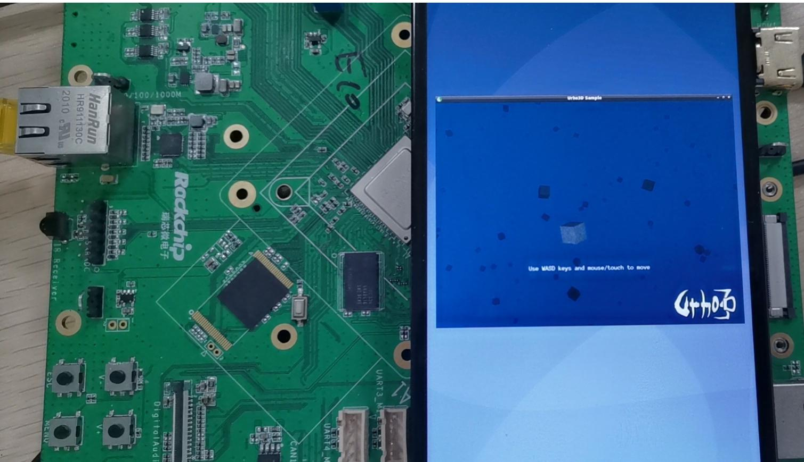
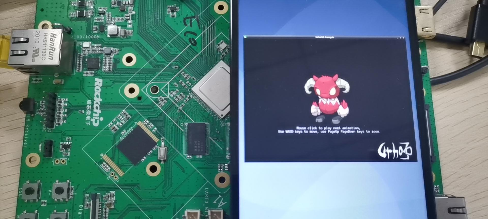
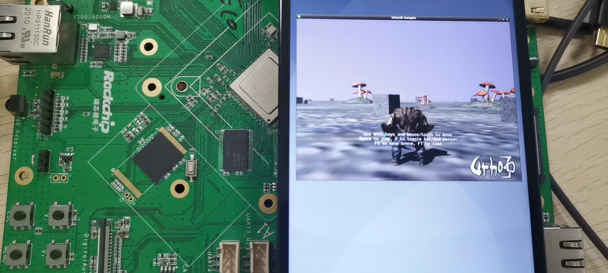

# rockchip_urho3d_arm

**Urho3D** is a free lightweight, cross-platform 2D and 3D game engine implemented in C++ and released under the MIT license. Greatly inspired by OGRE and Horde3D.

Main website: https://urho3d.io/

github: https://github.com/urho3d/Urho3D


### introduce

RockChip_urho3d_arm is an ARM version based on URho3D and ported on the Rockchip ARM chip platform. At present, all arm game consoles on the market use emulators, which will greatly reduce the performance, or it is a closed source console like Nintendo. I have always hoped to make a native ARM game engine. The purpose of porting it is to have a game engine that can run on ARM machines, so that games can be directly developed on ARM platform, and an open source console environment can be built, on which people all over the world can develop games. The platform I use is Rockchip-RK3568, and all demo of URho3D have been run. The hardware platform I use is RK3568 + debian10. If you are interested in this project, or if you are a programmer with the same interest, please contact me at 444936382@qq.com 







### Compiling method

**note: Before you start, make sure your ARM machine is Linux and supports SDL and X11 MMX, 3DNow!, and SSE/SSE2 instructions will be used if supported), GPU with OpenGL 2.0 support, EXT_framebuffer_object and EXT_packed_depth_stencil extensions.**

The script for the compilation environment initialization is provided below: build_urho3d.sh，init_engine_environment.sh，Of course, these scripts are just compilation references, and you can try to execute them, as the diversity of ARM platforms makes it impossible to build uniform scripts, I'm using the debian10, Copy the script where you want it（for example: ~/home/username），Execute it：

```
./init_engine_environment.sh
```

After the execution is complete, run again:

```
./build_urho3d.sh
```

After that, we need to :(or you can go to Urho3D/resources and overwrite the CoreData directory to the Data directory, as I did below)

```
cp -r /usr/local/share/Urho3D/resources/CoreData   /usr/local/share/Urho3D/resources/Data 
```

Next, since urho3d uses the SDL framework, you need to set some environment variables such as :(of course, you can also write to ~/.bashrc)

```
export SDL_VIDEODRIVER=x11
```

Finally, you can run the Urho3D demo:

```
01_HelloWorld   -p /usr/local/share/Urho3D/resources/Data/
```

